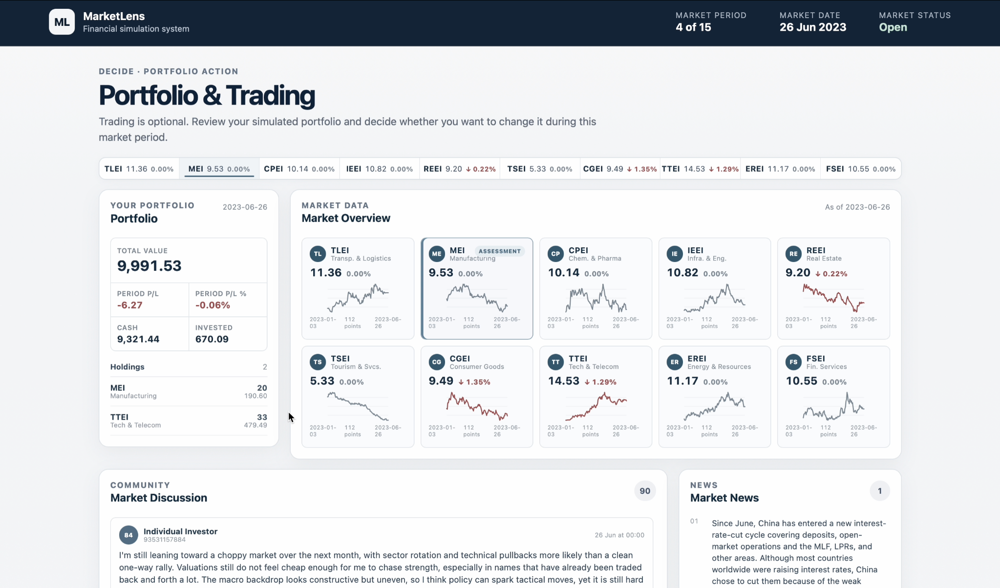
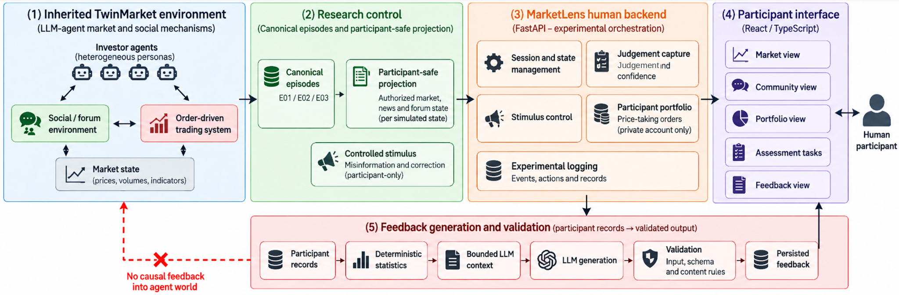
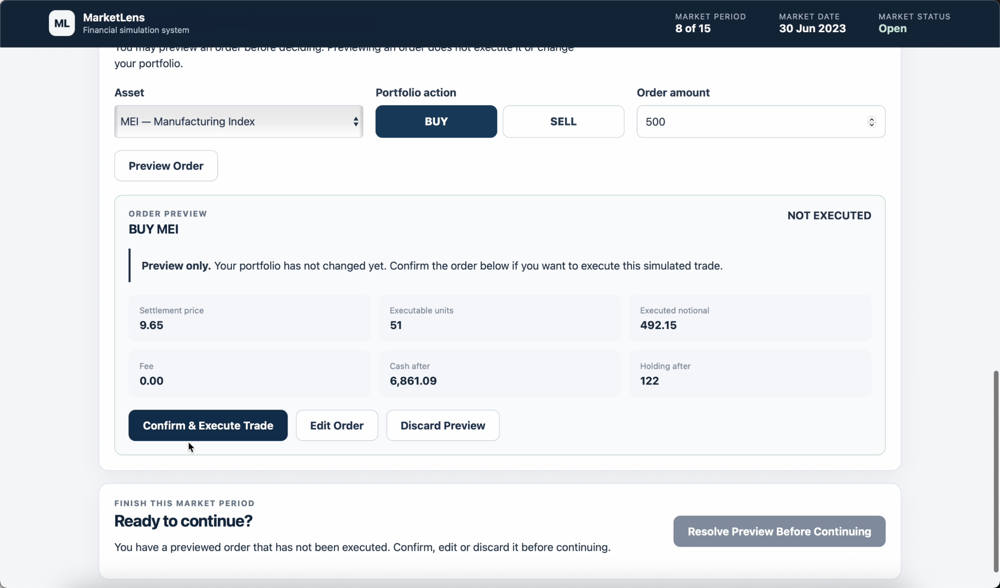

# MarketLens

### Human-AI Multi-Agent Financial Decision Environment

MarketLens is a web-based financial decision simulation platform where participants interact with a dynamic LLM-agent market, make repeated investment judgements and simulated trades, receive new evidence, and decide whether to revise their views over time.

**60 participants** · **60/60 completed sessions** · **180/180 feedback delivered** · **755/755 regression tests passed**

> Built as a human-participant product layer on top of TwinMarket, with controlled information exposure, independent participant state, traceable decision records, and system-level evaluation.

<p align="center">
  
</p>

---

## Why MarketLens?

Most financial simulations record only the final trade. That misses an important part of the decision process: a user may change their judgement without trading, or trade without changing their stated view.

MarketLens therefore captures the full decision chain:

**Information → Judgement → Confidence → Evidence → Action → New Information → Revision → Reflection**

For each formal judgement, the platform records:

- BUY / HOLD / SELL judgement
- confidence
- evidence used
- written rationale
- requested and executed orders
- portfolio position
- information exposure

This makes it possible to compare **what users think** with **what they actually do**.

---

## Product Experience

Each participant completes a continuous 15-period financial decision journey with five formal judgement checkpoints.

| Checkpoint | User task |
|---|---|
| **J0** | Form an initial judgement |
| **J1** | Reassess after new unverified information |
| **J2** | Reassess after continued market activity |
| **J3** | Respond immediately after authoritative correction |
| **J4** | Form a final judgement after subsequent market activity |

Core journey:

**Market Context → Judgement → Simulated Trade → New Information → Correction → Judgement Update → Reflection**

---

## How It Works

MarketLens combines two layers.

<p align="center">
  
</p>

### Multi-Agent Market

The formal environment uses **30 financial agents**:

- 12 Fundamental agents
- 18 Technical agents

Agents maintain differentiated strategies, beliefs, behavioural characteristics and portfolio states. Their decision process follows a BDI-style loop:

**Belief → Desire → Intention → Action → Environment Response → Belief Update**

### Human Participant Layer

Participants share the simulated market context but maintain independent:

- sessions
- cash
- holdings
- judgements
- orders
- feedback
- event histories

Participant trades affect only the participant ledger and do **not** change the canonical Agent world.

**Shared Environment Context + Independent Participant State**

---

## AI vs Deterministic System

A key product decision was not to let the LLM control every part of the system.

| LLM / Agent | Deterministic system |
|---|---|
| Semantic interpretation | Cash |
| Market reasoning | Holdings |
| Belief update | Price state |
| Information interpretation | Order validation |
| Social content | Settlement |
| Reflective feedback | Session progression |
|  | Information release |
|  | Record linkage |

> **Use the model where reasoning is valuable; use deterministic code where correctness must be exact.**

---

## Context and State

MarketLens separates context into four layers:

- **Static Profile** — persona, strategy and behavioural attributes
- **Dynamic State** — belief, holdings, cash and previous actions
- **Turn Context** — current market, news, visible posts and task
- **Participant Session State** — period, exposure, judgement, confidence, order and feedback

The context pipeline follows:

**Hard Filter → Candidate Retrieval → Context Assembly → LLM**

Time, session, participant and information-access boundaries are enforced before semantic relevance is considered.

The codebase includes embedding operations for semantic representation/retrieval support, but MarketLens does not present this as a complete production RAG pipeline.

---

## Reliability by Design

### Trading Guardrails

Trading actions are checked against deterministic constraints including:

- available cash
- current holdings
- valid price
- valid action
- position limits
- no short selling

The order flow separates preview from execution so that a proposed trade can be inspected before it changes portfolio state.

<p align="center">
  
</p>

### Session Isolation

Each participant has an independent ledger and session state. One participant cannot alter another participant's portfolio, judgement history or feedback.

### Feedback Reliability

Reflective feedback follows:

**Authoritative Records → Deterministic Statistics → Bounded Context → LLM → Validation → Retry → Validated Output / Fallback**

Formal deployment delivered **180 / 180 feedback responses**, including:

- **152 validated live-provider responses**
- **28 validated fallback responses**

> **Validated fallback > invalid AI output > broken user flow**

---

## Evaluation

MarketLens uses system-level release gates rather than relying on one model metric.

### Agent Activity

Population adequacy was tested across **100 fixed seeds × 27 simulation ticks**.

| Population | Zero-active critical trajectories | Mean active agents | Decision |
|---|---:|---:|---|
| N20 | 9 / 100 | 3.88 | Fail |
| N30 | 0 / 100 | 6.26 | Pass |

N30 was selected for the formal environment.

### Trading Validation

Across 27 research-relevant trading paths, **111 / 111 order requests executed** under both 0 bps and 10 bps transaction-cost settings.

### Session Integrity

Formal audit confirmed:

- **60 / 60 completed sessions**
- **60 / 60 completed all 15 periods**
- **60 unique sessions**
- **60 / 60 completed J0–J4**
- complete participant-visible histories

### Regression

The frozen release completed **755 / 755 automated regression tests passed**.

---

## Formal Product Results

| Metric | Result |
|---|---:|
| Participants | **60** |
| Session completion | **60 / 60** |
| Episodes | **3 × 20 participants** |
| Periods | **15 / participant** |
| Formal judgements | **300** |
| Period records | **900** |
| Feedback | **180 / 180 delivered** |
| Executed transactions | **64** |
| Main outcome coverage | **60 / 60** |

---

## Product Insight

One of the strongest results was the difference between attention, judgement and behaviour.

After authoritative corrective information:

**59 / 60 noticed the correction → 3 / 60 changed judgement → 1 / 50 immediately reduced the target position**

> **Attention ≠ Judgement Change ≠ Behaviour Change**

This is why MarketLens measures information attention, confidence, judgement and action separately instead of using a single final-trade metric.

---

## Key Product Decisions

| Trade-off | Decision |
|---|---|
| **Dynamic AI vs Comparability** | Generate dynamic Agent environments, then freeze canonical episodes for participant replay |
| **AI Autonomy vs Reliability** | LLM for reasoning, deterministic code for financial state |
| **Semantic Retrieval vs State Control** | Hard boundaries before semantic retrieval |
| **Personalisation vs Stability** | Validated feedback with retry and fallback |
| **Agent Richness vs Runtime** | Select N30 through explicit environment gates |
| **Participant Influence vs Integrity** | Participant trades do not change the canonical Agent world |

---

## Tech Stack

**Frontend:** React · TypeScript · Vite

**Backend:** Python · FastAPI · SQLite · SQLAlchemy

**AI / Agent:** LLM-driven agents · BDI-style reasoning · Tool-use · Structured output validation · Bounded context assembly · Embedding support · Retry / fallback runtime

**Evaluation:** pytest · deterministic protocol audits · population-sensitivity testing · trajectory validation · participant/session audits

---

## Repository Structure

```text
MarketLens/
├── frontend/              # Participant-facing React application
├── marketlens/
│   ├── agents/
│   ├── episode/
│   ├── experiment/
│   ├── human/
│   ├── information/
│   ├── market/
│   ├── measurement/
│   ├── persistence/
│   ├── stimulus/
│   └── validation/
├── scripts/
├── tests/
├── data/
├── docs/
└── trader/
```

---

## Local Development

Create the Python environment:

```bash
python3 -m venv .venv
source .venv/bin/activate
pip install -r requirements-marketlens-backend.txt
```

Install frontend dependencies:

```bash
cd frontend
npm install
```

Provider-specific configuration should be created locally and must not be committed.

---

## Research Data and Privacy

Formal participant credentials and participant runtime databases are intentionally excluded from the public repository.

The public repository contains simulation assets required for reproducibility, while participant-private study data remain local.

MarketLens is a research simulation environment and does not provide financial advice or live trading services.

---

## Research Context

MarketLens was developed as part of an MSc Applied Artificial Intelligence dissertation at the University of Warwick.

The project studies how participants revise financial judgements following corrective evidence within a continuing LLM-agent financial information environment.

---

## Upstream Attribution

MarketLens uses **TwinMarket** as the underlying LLM-agent financial simulation environment.

TwinMarket was developed by Yuzhe Yang, Yifei Zhang, Minghao Wu, Kaidi Zhang, Yunmiao Zhang, Honghai Yu, Yan Hu and Benyou Wang, and was accepted at NeurIPS 2025.

The original upstream README is retained at:

`docs/upstream/TWINMARKET_ORIGINAL_README.md`

MarketLens-specific work focuses on the human-participant product layer, controlled information flow, participant state, interaction design, evaluation, validation and formal deployment.

---

## License

This repository retains the applicable MIT License.

Please also refer to the original TwinMarket project and authors when reusing the underlying simulation components.
